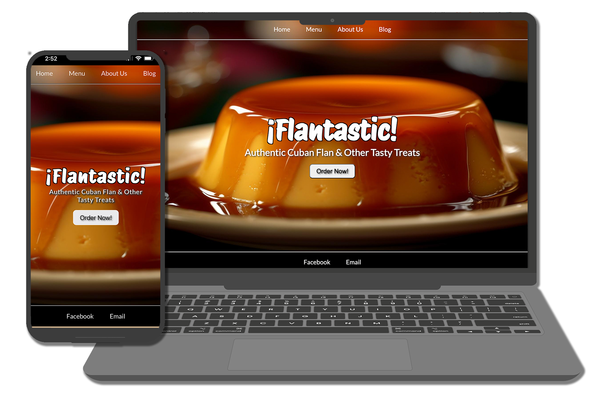

# Description
¡Flantastic! is a fully responsive e-commerce site built in HTML, CSS, and ReactJS. The site uses the Shopify Buy-Button integration for secure payment processing 

# Screenshot
¡Flantastic! features a fully responsive design to provide a great experience for users on all devices.

# Shopify Buy-Button

Shopify generates the embed code which allows you to present your products exactly how you want.

Quickly add a mobile-friendly and secure shopping experience to your site. All the power of Shopify in a single button.